# Open Turbofan Architecting

OTA is an open-source system architecture optimization problem with the purpose of demonstrating the principle of
system architecture optimization, and implementing a realistic problem for optimization algorithm benchmarking.

System architectures are defined by assigning components to functions, and by connecting components among each other. A
system architecture design space can consist of multiple components able to fulfill a function, which gives architecting
decisions and thereby defines the architecture design space. An architecture optimization problem gathers all these
decisions (e.g. function assignment, component attributes, component connections) and formulates it as a formal
optimization problem: in terms of design variables, objectives, and constraints.

The turbofan architecting problem has the goal of finding the best possible turbofan architecture according to one or
more objectives: for example fuel burn, emissions, or weight. It is also possible to use multiple of these objectives at
the same time when performing multi-objective optimization, with the result of finding a Pareto front of optimal
architectures.

For evaluation of the turbofan architectures thermodynamic cycle, [pyCycle](https://github.com/OpenMDAO/pyCycle) is used.
PyCycle is a modular engine cycle analysis and sizing framework based on [OpenMDAO](https://openmdao.org/), a powerful
Python-based Multidisciplinary Design Optimization (MDO) framework. For the other disciplines, empirical correlations from
literature are used, whose equations can be found in the Python files.

OTA consists of two main packages:
1. *Evaluation*: The **engine architecture evaluator** provides an interface for defining engine architectures and
   enables the evaluation of a given architecture for specific operating conditions using pyCycle.
2. *Architecting*: The **engine architecting framework** provides a way to describe architectural choices and define an
   optimization problem, and a way to translate design vectors (as generated by an optimization algorithm) to engine
   architectures.

## Installation

Clone the repository and install dependencies using `pip` from an environment with at least Python 3.6:
```
pip install .
```
   
## Benchmark Problem

Two benchmark problems have been created: a simple architecting problem and a realistic architecting problem.

##### Design Choices

The implemented architecting choices and their design variable mappings can be found in the list below, in order of execution.
The order of execution is important as some architecting choices are dependent on decisions made in previous architecting choices.
1. The first architecting choice is the inclusion of a fan at the front of the engine. In case a fan is not included, the resulting
engine architecture is a turbojet. Otherwise, the architecture is identified as a turbofan. For a turbofan architecture, two
additional design variables are activated: the Bypass Ratio (BPR) and the Fan Pressure Ratio (FPR).
2. If the result of the first architecting choice is to include a fan, the option arises to include a second fan at the front of the
engine which rotates at the same speed but the opposite direction as the main fan. This concept is called a Counter-Rotating
Turbofan (CRTF).
3. Next, the number of shafts is decided: the engine architecture will have either one, two or three shafts. These can be referred
to as the low-, intermediate- and high-pressure shafts. For each shaft, the RPM is also a design variable. Furthermore, the OPR of
the complete engine needs to be specified, as well as the percentage of the Overall Pressure Ratio (OPR) that each compressor generates.
4. To enable the fan to rotate at an optimal speed, a gearbox can be inserted between the low-pressure shaft and the fan shaft.
This architecture is referred to as the Geared Turbofan (GTF). In case a gearbox is included, the gear ratio is a design variable.
5. It is possible to include a second combustion chamber in the engine architecture, called an Inter-Turbine Burner (ITB). As the
name suggest, the ITB is located between two turbines aft of the main combustion chamber. When the ITB is selected, its Fuel-to-Air
Ratio (FAR) is a design variable.
6. In order to cool the turbine or to regulate the axial velocity of the compressor gases, air can be bled from the compressors
through bleed valves. This air is referred to as cooling bleed and is a design choice, opposed to the extraction bleed (see choice 9).
For the engine architecting problem, the amount of cooling bleed and its targets (i.e. defined turbines) need to be specified for
each individual compressor. The implementation of cooling bleed is split up into intra-bleed and inter-bleed: the former defines a
situation where air is bled from within a compressor, whereas for the latter it is bled from in between two compressors.
7. For turbofans, a choice can be made between a separate or mixed flow nozzle. In the mixed flow nozzle, the flow of the core and
the bypass is mixed at the end of the engine and leaves the engine through one joint nozzle, whereas this is not the case for a
separate flow nozzle.
8. On stationary and marine gas turbines, a heat rejection method is sometimes implemented called intercooling. During this process,
heat is removed from in between two compressors using a heat exchanger. In the architecting problem, an intercooler can be added
by specifying its location in the engine and its geometry (radius, length and number of pipes).
9. Power and extraction bleed offtakes are specified as part of the engine requirements, and are therefore always present in an
engine architecture. Power offtakes are satisfied by extracting electrical power from one of the engine shafts in order to power
different systems onboard the aircraft. For extraction bleed, air is bled from one of the compressors to support for example the
Environment Control System (ECS) or anti-icing systems of the aircraft. The offtake location (both for power and extraction bleed)
can be specified with the design variables.

In total, the design space includes 41 design variables: 6 categorical, 5 integer and 30 continuous. Only the discrete variables
already account for approximately 1.3 million engine design points.

##### Operating Conditions

The operating conditions of the aircraft engine optimized in the benchmark problem are the same as the operating conditions for
the LEAP-1C engine:
* Mach ≈ 0
* Altitude = 0 ft
* Thrust = 150 kN
* Turbine inlet temperature = 1450 degC
* Extraction bleed = 0.5 kg/s
* Power offtake = 37.5 kW

### Simple Architecting Problem

The simple architecting problem can be accessed via the `tests\examples\simple_problem.py` file. The file is ready to run.
However, the user can specify the location to save results on line 90.

This engine architecting problem features only one objective (TSFC), and only design feasibility constraints. The included design
choices are: fan inclusion (1), number of shafts (3), gearbox implementation (4), nozzle type (7), and offtake locations (9). The
numbers indicate the specific architecting choices defined before. These design choices result in 15 design variables and the creation
of solely conventional engine architectures. In total, 15 distinct engine architectures and 216 engine design points can be generated
taking into account the discrete design variables. The popular multi-objective optimization algorithm NSGA-II with a population size
of 75 and termination criteria of 1000 evaluations was used to run the optimization in the pymoo framework.

The architectures were analyzed, and their results are presented. All feasibility constraints are satisfied. Approximately 49% of
the generated engine architectures converged during the initial DOE, whereas this increased to 92% for the last iteration.

The lowest achieved TSFC is an ultra-high BPR (UHBR) turbofan with a TSFC of 6.7 g/kNs.

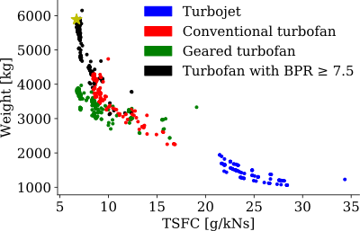 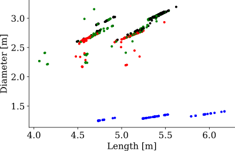 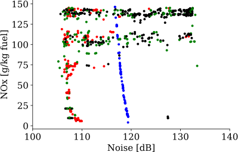
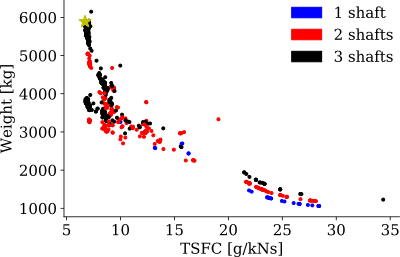 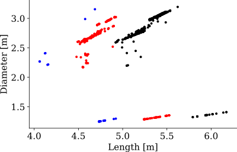 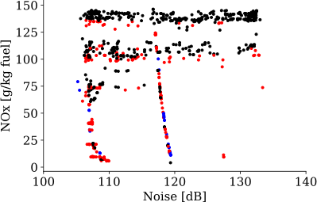

### Realistic Architecting Problem

The realistic architecting problem can be accessed via the `tests\examples\realistic_problem.py` file. The file is ready to run.
However, the user can specify the location to save results on line 42.

This engine architecting problem is constructed and solved to provide a target Pareto front for future optimization algorithm research.
The realistic architecting problem contains three conflicting objectives (TSFC, weight and noise), and multiple constraints (e.g.
geometry and emissions). All available design choices are included in the problem, leading to 41 design variables. This results in the
possibility to generate 85 distinct engine architectures and approximately 1.3 million engine design points taking all discrete variables
into account. Evaluating one engine design point can take up to two minutes, making for a challenging optimization problem. The same
NSGA-II algorithm is used as for the simple architecting problem. The population size was set to 205 and the termination criteria to
4000 evaluations, to account for the increase in number of design variables.

All constraints imposed on the architecture are satisfied. This shows that the benchmark problem achieves feasible results for the engine
disciplines. From the generated engine architectures, 33% converged during the initial DOE whereas this increased to 92% for the last iteration.

The Pareto front is available by loading the pymoo problem using `get_pymoo_architecting_problem` in
`open_turb_arch/architecting/architecting_problem.py`.

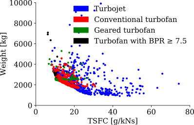 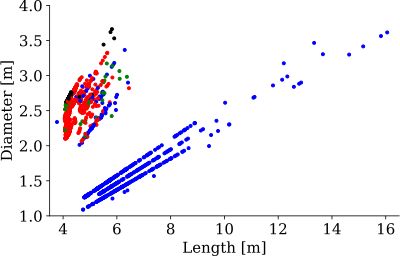 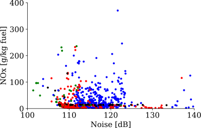
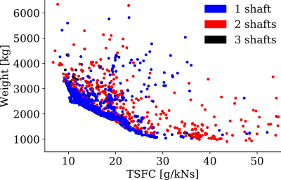 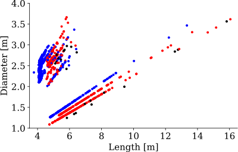 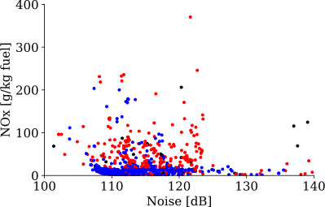
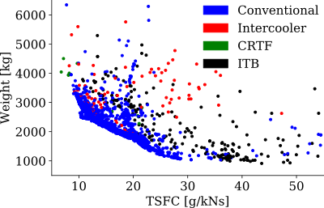  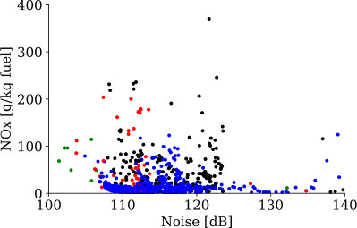
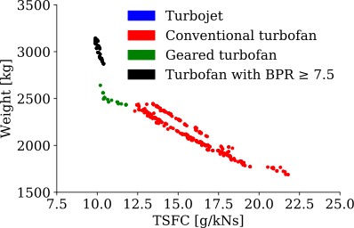 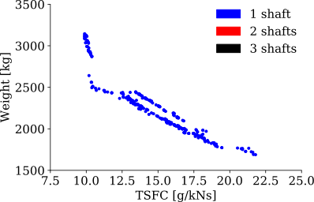 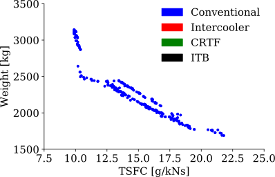

## Engine Cycle Analysis Structure

Engine cycle analysis problems are defined based on a design point and zero or more off-design points. Each of these
points define operating conditions such as Mach number and altitude, and requirements like required thrust and bleed
and/or power offtakes. The design point is first solved by sizing the cross-sectional areas of all flow stations and
balancing the engine such that the required thrust is produced. Then, the off-design points are synchronized with the
design point (mainly in terms of flow station areas), and then balanced such that also they produce their respective
thrust requirements. Balancing means the variation of several variables such as throttle setting (usually represented
by fuel-to-air ratio in the combustor) and turbine pressure ratio such that the engine cycle is consistent: the required
thrust is produced and the net energy in the shafts are zero (i.e. as much energy is added as extracted).

pyCycle implements this procedure as follows:
1. A pyCycle `Cycle` component is defined that represents one design point and implements the engine architecture
   including balancing logic for this design point (this also includes correctly connecting the flows of the elements).
2. A pyCycle `MPCycle` (multi-point cycle) component is defined that instantiates the previously defined `Cycle`
   components for the design point and off-design points, and connects the design point to the off-design points.
3. An OpenMDAO `Problem` is defined that includes the previously defined `MPCycle` and defines the operating conditions
   of the design points.

Note that the OTA framework normally works in SI units, but that pyCycle internally uses the American system. OpenMDAO,
however, is unit-aware and therefore when requesting results from a solved problem, it is possible to request the output
in terms of SI units. As an example of this see `ArchitectureCycle._print_performance`.

## Engine Architecture Evaluator

The engine architecture evaluation (the `open_turb_arch.evaluation` package) consists of two parts: a way to define an
engine architecture, and code for evaluating an architecture using pyCycle and OpenMDAO.

Note that the evaluator can be used by standalone and does not depend on the architecting framework at all.

### Architecture Definition

An architecture is defined by the `TurbofanArchitecture`, that contains a set of `ArchElement` instances. The
`ArchElement` classes define how a specific element of an engine architecture (e.g. a compressor or a turbine) is
implemented in pyCycle, and how to connect it to other elements. Most of the `ArchElement` implementations have one
target element, that defines where to connect its output flow to.

The implementations of the `ArchElement` classes are distributed over two modules, separated into elements concerning
air flow (inlet, duct, splitter, bleed, mixer, nozzle, heat exchanger) and turbomachinery (compressor, burner, turbine,
gearbox, shaft). Each element contains its own design parameters with default values.

A valid architecture has at least an inlet and a nozzle, which are automatically connected to the freestream flow.

An example of a simple turbojet architecture:
```python
from open_turb_arch.evaluation.architecture import *

# Define architecture elements connected to each other
# The nozzle needs no connection target: it will be automatically connected to the freestream
inlet = Inlet(name='inlet', mach=.6, p_recovery=1)

inlet.target = compressor = Compressor(name='comp', map=CompressorMap.AXI_5, mach=.02, pr=13.5, eff=.83)

compressor.target = burner = Burner(name='burner', fuel=FuelType.JET_A, mach=.02, p_loss_frac=.03)

burner.target = turbine = Turbine(name='turb', map=TurbineMap.LPT_2269, mach=.4, eff=.86)

turbine.target = nozzle = Nozzle(name='nozz', type=NozzleType.CD, v_loss_coefficient=.99)

# Connect the shaft to the turbomachinery
shaft = Shaft(name='shaft', connections=[compressor, turbine], rpm_design=8070, power_loss=0.)

# Define the architecture
architecture = TurbofanArchitecture(elements=[inlet, compressor, burner, turbine, nozzle, shaft])
```

#### Defining a New Element

Defining a new `ArchElement` is done as follows:
1. Create a new subclass inheriting from `ArchElement`
2. Designate it a dataclass to have a more concise syntax for defining attributes: `@dataclass(frozen=False)`
3. Implement at functions for adding the element to a pyCycle problem:
   1. `add_element_prepare` (optional): perform any operations before actually adding the element to the pyCycle `Cycle`
   2. `add_element`: adds the element to the pyCycle `Cycle` and optionally defines input defaults using
       `el.set_input_defaults`
   3. `connect`: connects the element to the next element(s) using `self._connect_flow_target` or
      `cycle.pyc_connect_flow`
   4. `add_cycle_params` (optional): adds parameters shared between all cycles using `mp_cycle.pyc_add_cycle_param`
   5. `connect_des_od`: connect the design point to the off-design point using `mp_cycle.pyc_connect_des_od`
   6. `set_problem_values` (optional): set top-level problem values using `problem.set_val`

### Evaluation Using pyCycle/OpenMDAO

Once an architecture has been defined, it can be evaluated using the `CycleBuilder` class. In addition to the
`TurbofanArchitecture`, it also needs an `AnalysisProblem` that defines the design and off-design points.

The operating conditions are defined by the `DesignCondition` and `EvaluateCondition` classes.

The `CycleBuilder` builds an OpenMDAO problem using the `ArchitectureMultiPointCycle` and `ArchitectureCycle` classes
that represent the multi-point cycle and the cycle and call all relevant `ArchElement` methods to actually construct
the cycle analysis. The operating conditions also define the balancing schemes, which are implemented by `Balancer`
classes, and also contain their own logic of how to implement them into the cycle.

Results from executing a cycle are provided as mapping between the operating conditions and `OperatingMetrics`
instances, that contain data like the TSFC, thrust, OPR and mass flow rate. Once the cycle has been executed and results
have been generated, other aircraft engine disciplines can be evaluated with the `TurbofanArchitecture` and
`OperatingMetrics` as input data. These engine disciplines include weight, geometry and environmental impact.

An example of using the cycle builder:
```python
from open_turb_arch.evaluation.analysis import *
from open_turb_arch.evaluation.architecture import *

# Define the architecture
architecture = TurbofanArchitecture(elements=[...])

# Define the analysis problem (altitude in ft, thrust in N, temperatures in C, mass flow in kg/s)
analysis_problem = AnalysisProblem(
    design_condition=DesignCondition(
        mach=1e-6, alt=0,
        thrust=52489,  # 11800 lbf
        turbine_in_temp=1043.5,  # 2370 degR
        balancer=DesignBalancer(init_turbine_pr=4.),
    ),
    evaluate_conditions=[
        EvaluateCondition(
            name_='OD0',
            mach=1e-5, alt=0,
            thrust=48930.3,  # 11000 lbf
            balancer=OffDesignBalancer(init_mass_flow=80.),
        ),
        EvaluateCondition(
            name_='OD1',
            mach=.2, alt=5000,  # ft
            thrust=35585.8,  # 8000 lbf
            balancer=OffDesignBalancer(init_mass_flow=80.),
        ),
    ],
)

# Build the OpenMDAO problem
builder = CycleBuilder(architecture=architecture, problem=analysis_problem)
prob = builder.get_problem()
builder.view_n2(prob, show_browser=False)

# Run the problem
builder.run(prob)

# Print and process results_
builder.print_results(prob)
print('\nOutput metrics:')
for condition, metrics in builder.get_metrics(prob).items():
    print('%8s: %r' % (condition.name, metrics))
```

## Engine Architecting Framework

The engine architecting framework enables the definition of the architecting problem and the evaluation of generated
architectures. The main interface is the `ArchitectingProblem` class, which gathers the defined `ArchitectingChoice` and
`ArchitectingMetric` classes and interprets them to formulate design variables, objective, constraints, and generic
output metrics.

Additionally it contains interfaces for evaluating a design vector and returning associated objective, constraint, and
output metric values. Evaluating a design vector is done by first generating the architecture and imputing the design
vector based on which design variables are active or not. Each `ArchitectingChoice` used in the problem contains its own
logic for modifying the default turbojet architecture based on the values of their design variables. Once an 
architecture has been generated, the `CycleBuilder` is used to evaluate the architecture. Its results are then
interpreted into metrics by the `ArchitectingMetric` instances used. Result caching is used to prevent the same
architecture being evaluated more than once.

An example using the `FanChoice` and `TSFCMetric`:
```python
from open_turb_arch.architecting import *
from open_turb_arch.architecting.metrics import *
from open_turb_arch.architecting.turbofan import *
from open_turb_arch.evaluation.analysis import *

# Define analysis problem
analysis_problem = AnalysisProblem(
    design_condition=DesignCondition(
        mach=1e-6, alt=0,
        thrust=20017,  # 4500 lbf
        turbine_in_temp=1314,  # 2857 degR
        balancer=DesignBalancer(init_turbine_pr=8.36),
    ),
    evaluate_conditions=[
        EvaluateCondition(
            mach=1e-6, alt=35000,
            thrust=10000,  # 4500 lbf
            balancer=OffDesignBalancer(init_mass_flow=80.),
        ),
    ],
)

architecting_problem = ArchitectingProblem(
    analysis_problem=analysis_problem,
    choices=[
        FanChoice(  # FanChoice determines whether a fan is included or not
            fix_include_fan=None,  # Fix the fan choice for this problem: set to True or False
            fixed_bpr=None,  # Fix the bypass-ratio for this problem
            fixed_fpr=None,  # Fix the fan pressure ratio for this problem
        ),
    ],
    objectives=[
        # Use the design condition TSFC as objective
        TSFCMetric(),
    ],
    constraints=[
        # Use the TSFC of the first off-design condition as a constraint with a max of 0.25
        TSFCMetric(max_tsfc=.25, condition=analysis_problem.evaluate_conditions[0]),
    ],
    metrics=[
        # Track the TSFC of the second off-design condition
        TSFCMetric(condition=analysis_problem.evaluate_conditions[1]),
    ],
)

# Define the design vector
design_vector = [1, 3., 1.5]  # Include a fan with a bypass ratio of 3 and a fan pressure ratio of 1.5
# design_vector = [0, 3., 1.5]  # Do not include a fan (the other two design variables are inactive)

# Evaluate the architecture
print('Design vector (input): %r' % design_vector)
design_vector, objectives, constraints, metrics = architecting_problem.evaluate(design_vector)

# Print results_
print('Design vector (output): %r' % design_vector)  # Changed if there are inactive design variables
print('Objectives: %r' % objectives)
print('Constraints: %r' % constraints)
print('Metrics: %r' % metrics)
```

### Defining New Architecting Choices

An `ArchitectingChoice` can define one or more design variables, and contains the logic to modify the architecture based
on the values of these design variables.

Design variables are defined using either `ContinuousDesignVariable` or `DiscreteDesignVariable`, for continuous and
integer (or categorical) design variables, respectively.

The `modify_architecture` method takes the current `TurbofanArchitecture`, the operating conditions `AnalysisProblem`
and the values of the design variables defined by the `ArchitectingChoice` class. It should return a list specifying
whether or not each design variable is active. For example, `FanChoice` defines three design variables: fan, bpr, fpr.
The latter two only apply if a fan is actually included, so if the first design variable defines there is no fan, the
other two are not active.

### Defining New Architecting Metrics

An `ArchitectingMetric` in general defines behavior of output metrics. Its behavior can depend based on whether the
`ArchitectingMetric` is used as an objective, constraint, or generic output metric (as specified when instantiating
the `ArchitectingProblem`).

The actual metric values are extracted from the results returned from the cycle analysis: a mapping between operating
conditions and `OperatingMetrics`. For example, the `TSFCMetric` simply reads the TSFC from the specified operating
condition or the design condition if none specified.

### Optimization Framework Integration

To help with testing optimization algorithms, the `ArchitectingProblem` class offers interfaces to optimization
frameworks.

#### Pymoo

Integration with [Pymoo](https://pymoo.org/):
```python
from pymoo.optimize import minimize
from pymoo.algorithms.nsga2 import NSGA2
from open_turb_arch.architecting import *

# Define architecting problem
architecting_problem = ArchitectingProblem(...)

# Get pymoo problem
problem = architecting_problem.get_pymoo_problem()

# Run algorithm
algorithm = NSGA2()
results = minimize(problem, algorithm, termination=('n_eval', 4000))
```

#### OpenMDAO

Integration with [OpenMDAO](https://openmdao.org/):
```python
import openmdao.api as om
from open_turb_arch.architecting import *

# Define architecting problem
architecting_problem = ArchitectingProblem(...)

# Define OpenMDAO problem
prob = om.Problem()
prob.driver = om.SimpleGADriver()
prob.model = architecting_problem.get_openmdao_component()
prob.setup()

# Run
prob.run_driver()
```

#### Platypus

Integration with [Platypus](https://platypus.readthedocs.io/):
```python
from platypus.algorithms import NSGAII
from open_turb_arch.architecting import *

# Define architecting problem
architecting_problem = ArchitectingProblem(...)

# Define Platypus algorithm
problem = architecting_problem.get_platypus_problem()
algorithm = NSGAII(problem)

# Run
n_eval = 10000
algorithm.run(n_eval)

print(algorithm.result)
```
